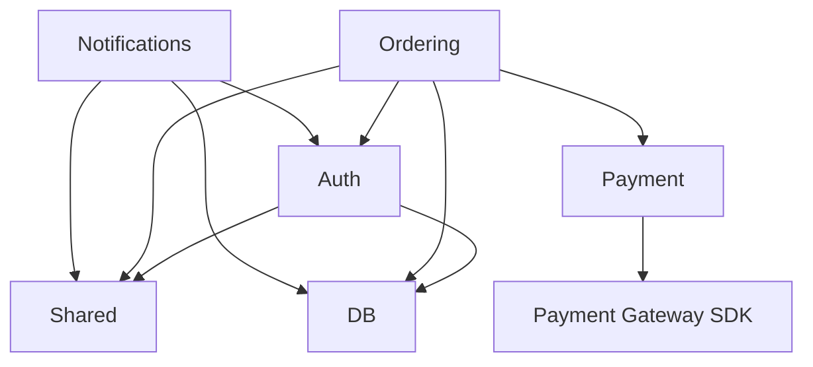

# Research Mode — Codebase Decomposition & Multi-Skill Generation

> **Research mode only.** Activated alongside `research_mode: true`. Decomposes a complex codebase into multiple independent skills, each targeting a high-level module, linked by a skill tree with upstream/downstream sync relationships.

## When to Decompose

After completing Phase 1 analysis, assess whether the codebase is complex enough to warrant multi-skill generation. Decompose if **two or more** of these criteria are met:

| Criterion | Threshold | How to measure |
|-----------|-----------|----------------|
| Module count | >= 5 top-level modules/packages | Count root-level directories under `src/` or the project's source root |
| Package depth | >= 4 levels of nesting | Deepest package path (e.g. `com.example.a.b.c.d` is depth 5) |
| Entry points | >= 3 independent entry points | CLI tools, web servers, plugin extensions, batch jobs, libraries with public APIs |
| Source lines | >= 50,000 LOC | `cloc --json .` or equivalent |
| Capability count | >= 8 capabilities identified in Phase 1.2 | From your functional boundaries analysis |
| External integrations | >= 4 distinct external services | APIs, databases, message queues, identity providers |
| Module coupling | Cyclic or dense cross-module imports | Generate a dependency graph and check for cycles or fan-in/fan-out > 5 |

If the codebase qualifies, proceed with decomposition. Otherwise, use the standard single-skill generation.

## Phase A — Module Discovery

### A.1 Identify High-Level Modules

Walk the source tree and identify top-level modules. A module is:

- A top-level directory under `src/` (e.g. `src/main/kotlin/com/example/{module}/`)
- A distinct Gradle/Maven subproject
- A package with its own public API surface and internal implementation
- A plugin, extension, or integration that could be developed independently

Record each module in a module inventory table:

```yaml
# module-inventory.yaml (generated during decomposition)
modules:
  - name: "auth"
    description: "Authentication and authorization"
    source_root: "src/main/kotlin/com/example/auth/"
    entry_points:
      - "src/main/kotlin/com/example/auth/LoginController.kt"
      - "src/main/kotlin/com/example/auth/TokenService.kt"
    imports_from:
      - "shared"
      - "db"
    depends_on:
      - "shared"
      - "db"
  - name: "ordering"
    description: "Order placement and fulfillment"
    source_root: "src/main/kotlin/com/example/ordering/"
    entry_points:
      - "src/main/kotlin/com/example/ordering/OrderController.kt"
    imports_from:
      - "auth"
      - "shared"
      - "db"
      - "payment"
    depends_on:
      - "auth"
      - "shared"
      - "db"
      - "payment"
```

### A.2 Extract Dependency Graph

Analyze import statements across all modules to build a directed dependency graph:



For each module, record:
- **Direct dependencies** — modules this module imports from
- **Transitive dependencies** — reachable through direct dependencies (relevant for cascading sync)
- **Cycles** — any bidirectional or circular dependency (record in conflict resolution)
- **Fan-in** — number of modules that depend on this one (high fan-in = shared/core module)
- **Fan-out** — number of modules this module depends on (high fan-out = integration module)

### A.3 Assign Module Tiers

Based on the dependency graph, assign each module a tier:

| Tier | Description | Examples | Sync behavior |
|------|-------------|----------|---------------|
| **0 — Foundation** | No internal dependencies, depended on by many | Shared utilities, DB layer, config | Changes cascade upward to all dependents |
| **1 — Domain** | Depends on Foundation, provides business logic | Auth, ordering, payment processing | Sync when tier 0 changes; their changes cascade to tier 2 |
| **2 — Integration** | Depends on Domain, orchestrates across domains | API gateway, notification service, webhook handler | Sync when tier 0 or 1 changes; no downstream |
| **3 — Entrypoint** | Application-specific entry points | CLI, web server, plugin, scheduled job | Depends on all lower tiers; no downstream |

### A.4 Detect Cycles

Cycles between modules must be flagged before generating skills. For each cycle:

1. **Identify the cycle** — record the circular path (e.g. `Auth → DB → Auth`)
2. **Decide resolution** — break the cycle by:
   - Extracting the shared dependency into a new Foundation module
   - Inlining the circular dependency into a single module
   - Recording a conflict resolution rule (see `research-mode.md` Conflict Resolution)
3. **Record** in the skill tree's conflict resolution section

```yaml
cycles:
  - path: ["auth", "db", "auth"]
    resolution: "Extract DBAccess from auth into a new shared-db Foundation module"
    resolved: true
```

## Phase B — Skill Tree Generation

### B.1 Map Modules to Skills

Each module becomes its own skillified project in a shared parent directory:

```
.opencode/skill/skillified-{project}/
├── SKILL.md                 # Orchestrator skill — overview, module index, cross-cutting concerns
├── config.yaml               # Global config — shared across all module skills
├── mapping.toml              # Top-level mapping
│
├── modules/
│   ├── auth/                 # Tier 1 — Domain
│   │   ├── SKILL.md
│   │   ├── config.yaml
│   │   └── mapping.toml
│   ├── ordering/             # Tier 1 — Domain
│   │   ├── SKILL.md
│   │   ├── config.yaml
│   │   └── mapping.toml
│   ├── payment/              # Tier 1 — Domain
│   │   ├── SKILL.md
│   │   ├── config.yaml
│   │   └── mapping.toml
│   ├── shared/               # Tier 0 — Foundation
│   │   ├── SKILL.md
│   │   ├── config.yaml
│   │   └── mapping.toml
│   └── db/                   # Tier 0 — Foundation
│       ├── SKILL.md
│       ├── config.yaml
│       └── mapping.toml
│
├── skill.lock                # Research mode — pins all module versions
└── resources/
    ├── module-inventory.yaml # Module discovery output
    ├── dependency-graph.md   # Graph description
    └── ...
```

### B.2 Declare Skill Tree Dependencies

Each module skill declares its upstream dependencies in frontmatter:

```yaml
---
name: skillified-ordering
version: 1.0.0
tier: 1
depends_on:
  - skill: skillified-auth
    version: ^1.0.0
    relationship: invokes
    source: modules/auth/
  - skill: skillified-shared
    version: ^1.0.0
    relationship: renders
    source: modules/shared/
  - skill: skillified-db
    version: ^1.0.0
    relationship: renders
    source: modules/db/
  - skill: skillified-payment
    version: ^1.0.0
    relationship: invokes
    source: modules/payment/
---
```

Foundation modules (Tier 0) declare no `depends_on`. Entrypoint modules (Tier 3) depend on all lower tiers.

### B.3 Generate Per-Module Skills

Each module skill follows the standard skillify template (SKILL.md, config.yaml, mapping.toml) scoped to that module's code:

- **SKILL.md** — only the capabilities that module provides
- **config.yaml** — only its own parameters; references to upstream skill params use `external:` prefix
- **mapping.toml** — only maps to files within its `source_root`

External references in config:

```yaml
# modules/ordering/config.yaml
thresholds:
  max_order_items: 50

# References to upstream skill parameters
upstream_config:
  auth:
    token_expiry_ms: 3600000   # mirrors modules/auth/config.yaml → limits.token_expiry_ms
    sync_mode: "mirror"        # change here must match auth's value
```

### B.4 Generate Orchestrator Skill

The root-level SKILL.md becomes an orchestrator that:

1. Lists all modules and their tiers
2. Documents cross-cutting concerns (logging, monitoring, deployment)
3. References the module index
4. Does NOT duplicate per-module capabilities

```yaml
---
name: skillified-cafe-platform
version: 1.0.0
modules:
  - skill: skillified-auth
    path: modules/auth/
    tier: 1
  - skill: skillified-ordering
    path: modules/ordering/
    tier: 1
  - skill: skillified-shared
    path: modules/shared/
    tier: 0
  - skill: skillified-db
    path: modules/db/
    tier: 0
  - skill: skillified-payment
    path: modules/payment/
    tier: 1
  - skill: skillified-api-gateway
    path: modules/api-gateway/
    tier: 2
---
```

## Phase C — Cascading Sync

### C.1 Sync Propagation Rules

When a change is made to any module in the skill tree, the sync propagates according to these rules:

| Change location | Effect | Sync action |
|----------------|--------|-------------|
| Foundation module (Tier 0) | All dependents may be affected | Identify all modules with `depends_on: [this]` → trigger forward sync on each |
| Domain module (Tier 1) | Direct dependents (Tier 2+) may be affected | Sync downstream only |
| Integration module (Tier 2) | No downstream effect | Sync module only |
| Config parameter in Foundation | All skills referencing that parameter | Mirror the change in each dependent's `upstream_config` |
| New capability added to Domain | Entrypoints may need to expose it | Only if the capability is part of the public contract |

### C.2 Lockfile for the Tree

The root-level `skill.lock` records versions of ALL modules:

```toml
# skill.lock
[project]
version = "1.0.0"

[modules]
  [[modules.entry]]
  name = "skillified-shared"
  version = "1.0.0"
  fixed_layer_hash = "sha256:..."
  open_layer_hash = "sha256:..."

  [[modules.entry]]
  name = "skillified-auth"
  version = "1.0.0"
  fixed_layer_hash = "sha256:..."
  open_layer_hash = "sha256:..."
  depends_on = ["skillified-shared", "skillified-db"]

  [[modules.entry]]
  name = "skillified-ordering"
  version = "1.0.0"
  fixed_layer_hash = "sha256:..."
  open_layer_hash = "sha256:..."
  depends_on = ["skillified-auth", "skillified-shared", "skillified-db", "skillified-payment"]
```

### C.3 Sync Verification Across Modules

After any multi-module sync:

1. **Version consistency** — all module versions referenced in `skill.lock` match their actual `config.yaml`
2. **Dependency integrity** — every `depends_on` entry has a corresponding module that exists and is at a compatible version
3. **No upstream drift** — Foundation modules haven't changed without downstream modules being re-synced
4. **Config mirroring** — all `upstream_config` mirror entries in module configs match their source
5. **Mapping completeness** — every mapped file is accounted for in exactly one module's mapping.toml (no overlap, no gaps)

### C.4 Conflict Resolution Across Modules

When two module skills disagree (e.g. Auth says "token expires in 1 hour", Ordering says "token expires in 30 minutes"):

1. **Detect** — during cascading sync, compare overlapping `upstream_config` values
2. **Flag** — add a conflict resolution entry to the root-level `mapping.toml`
3. **Resolve** — use the precedence rules from `research-mode.md`:
   - Foundation module values always win over Domain modules
   - Domain module values always win over Integration modules
   - If same tier: `human` authority, flag for manual resolution

```toml
# Root mapping.toml — cross-module conflict resolution
[conflict_resolution]
  [[conflict_resolution.rules]]
  id = "CR-CROSS-001"
  description = "Auth and Ordering disagree on token expiry"
  between = ["skillified-auth v1.0.0", "skillified-ordering v1.0.0"]
  conflict_type = "upstream_config_mirror"
  config_path = "upstream_config.auth.token_expiry_ms"
  authority = "upstream"
  upstream_override = "skillified-auth"
  resolution = "Auth is the authoritative source for auth config. Ordering must mirror."
  resolved_at = "2026-07-09"
  fixed_layer_impact = false
```

## Workflow Summary

```
1. Complete Phase 1 analysis → capability inventory, module count
2. Assess complexity (2+ criteria met? If not, use standard single skill)
3. Discover modules → module-inventory.yaml (Phase A.1)
4. Extract dependency graph → detect cycles, assign tiers (Phase A.2–A.4)
5. Generate module skills → one per module (Phase B.3)
6. Generate orchestrator skill → root SKILL.md (Phase B.4)
7. Build lockfile → root skill.lock with all module versions (Phase C.2)
8. Sync root → per-module mapping cross-references
9. Verify — run capability tests for every module
```

## CLI Helper Script

A lightweight bash script can be generated alongside the decomposed skill to validate module boundaries:

```bash
#!/usr/bin/env bash
# validate-boundaries.sh — Check no cross-module imports violate the dependency graph
# Generated as part of research mode decomposition.
# Usage: ./validate-boundaries.sh [module-name]

MODULE_INVENTORY="resources/module-inventory.yaml"

if [ ! -f "$MODULE_INVENTORY" ]; then
  echo "Error: $MODULE_INVENTORY not found. Run decomposition first."
  exit 1
fi

echo "Checking module boundary compliance..."
# (Implementation depends on language — greps for import statements
#  and verifies they only target declared dependencies)
```

Save this as `resources/validate-boundaries.sh` in the decomposed skill project.
