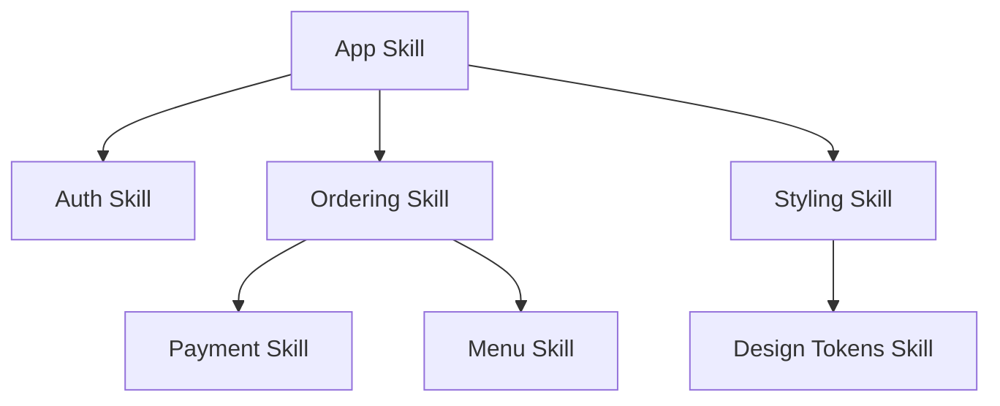

# Research Mode — Skills as Source Code

> **Optional add-on.** Not required for basic skillify usage. Activate when you need formal separation of fixed vs open layers, lockfile-pinned builds, skill dependency trees, or conflict resolution across upstream skills.

## The Model

**Skills are the new source code. Generation is the new compile step.**

An upstream skill — a spec, a style guide, a set of requirements — is the thing that's actually authored and maintained. The code an AI generates from it isn't the artifact anymore; it's a build output. Compile the same skill again tomorrow, get a different binary, same behavior.

Once code is a build output, the question becomes: **what's allowed to vary between builds, and what isn't?**

The answer is the **UI theming model**. A theme doesn't touch what a component does — click submit, form submits. It only varies color, spacing, font: the explicitly exposed, safe-to-change knobs. Everything load-bearing is fixed by contract upstream. Apply that to compiled code: the skill is the contract, the generated code is the theme — free to vary in structure, style, even algorithm — as long as the fixed layer (what a user must be able to do) stays intact.

---

## Affordance Schema — Separating Fixed from Open

The most critical design decision in a skillified project is: **what is fixed (non-negotiable, contract-level) vs what is open (implementation detail, free to vary between generations)?**

An affordance schema formalises this boundary — the way design tokens separate themeable properties from a component API. Every capability in the skill must declare both layers.

### Fixed Layer (Contract)

These properties are **load-bearing**. A change here triggers a full rebuild. Generated code MUST preserve these:

| Property | What it means | Examples |
|----------|---------------|----------|
| Capability name | The action a user can perform | `PlaceOrder`, `CalculateTax` |
| Input contract | What the caller must supply | Parameter names, types, required/optional, constraints |
| Output contract | What the caller receives | Return fields, types, error shapes |
| Observable behavior | What happens from the user's perspective | "Clicking submit sends the form" — not how |
| Business rules | Invariant decisions that define the domain | "Tax is 10% on food, 0% on drinks", "Orders over $50 ship free" |
| Error semantics | What each error means, not how it's rendered | "ItemOutOfStock is a 4xx, not a 5xx" — not the HTTP status code itself |

### Open Layer (Themeable / Free to Vary Between Builds)

These properties are **implementation detail**. The AI may vary them between generations without triggering a rebuild:

| Property | What it means | Examples |
|----------|---------------|----------|
| Algorithm choice | How a computation is structured | Sorting strategy, search method, loop vs recursion |
| Code structure | Module boundaries, class hierarchy, file organisation | `for` vs `while`, one file vs many, OOP vs functional |
| Variable naming | Internal identifiers | `orderTotal` vs `totalAmount` — as long as the output contract is met |
| Framework choice | Technology stack for implementation | Express vs Fastify vs Hono, as long as the contract is satisfied |
| Error rendering | How errors are presented to the user | JSON shape, HTML template, log format — error semantics are fixed |
| Performance tuning | Caching strategy, connection pooling, batch sizes | As long as observable behavior is preserved |

### Why Formal Affordances Matter

| Without affordances | With affordances |
|--------------------|------------------|
| AI agent treats everything as free to vary | Agent knows exactly what must be preserved |
| Every build regenerates the full codebase | Open-layer-only changes skip rebuild — just "re-theme" |
| No way to detect breaking changes in upstream skills | Lockfile compares fixed-layer hashes; mismatch = must rebuild |
| Skill tree conflicts are discovered at runtime | Conflicts are surfaced during sync, with precedence rules |

---

## Lockfile (`skill.lock`)

Every skillified project in research mode produces a lockfile that pins the exact state of the upstream skill(s) at the time of code generation. This is the skill equivalent of `package-lock.json`.

```toml
# skill.lock
# Generated: 2026-07-09

[skill]
version = "1.0.0"
content_hash = "sha256:abc123def456..."
fixed_layer_hash = "sha256:fixed-abc123..."
open_layer_hash = "sha256:open-def456..."
last_generated = "2026-07-09T10:30:00Z"
generator = "skillify-codebase v1.0.0"

[build]
trigger = "fixed-layer-change"
# Possible values: "fixed-layer-change" | "open-layer-change" | "initial" | "manual"

# Pinned upstream skill dependencies (the skill tree)
[[upstream]]
name = "styling-skill"
version = "2.1.0"
content_hash = "sha256:styling-abc..."
fixed_layer_hash = "sha256:styling-fixed..."
source = ".opencode/skill/styling-skill"

[[upstream]]
name = "auth-skill"
version = "1.3.0"
content_hash = "sha256:auth-def..."
fixed_layer_hash = "sha256:auth-fixed..."
source = ".opencode/skill/auth-skill"
```

### Lockfile Rules

| Rule | Detail |
|------|--------|
| **Check before build** | Before generating code, compare current skill hashes against lockfile hashes |
| **Fixed-layer mismatch = rebuild** | If the fixed-layer hash changed, a full rebuild is mandatory |
| **Open-layer-only change = re-theme** | If only the open-layer hash changed, skip rebuild — or do a lightweight regeneration that preserves the fixed contract |
| **Upstream fixed-layer mismatch = cascade** | If an upstream skill's fixed layer changed, ALL downstream skills must rebuild |
| **Commit lockfile** | The lockfile is committed alongside generated code. It documents exactly what was compiled. |

### Lockfile Verification

```bash
# Verify lockfile matches current skill state
skillify verify-lock --skill .opencode/skill/skillified-project --lock skill.lock
# Exits 0 if match, 1 with diff if mismatch
```

---

## Skill Tree (Dependencies)

Skills reference other skills, the way packages reference other packages. A styling skill sits underneath a component skill, which sits underneath an app-level skill.



### Declaring Dependencies

In the skill's frontmatter:

```yaml
---
name: skillified-cafe-ordering
version: 1.2.0
depends_on:
  - skill: styling-skill
    version: ^2.0.0
    relationship: renders
  - skill: auth-skill
    version: ~1.3.0
    relationship: invokes
---
```

### Dependency Relationship Types

| Type | Meaning | Sync impact |
|------|---------|-------------|
| `invokes` | Generated code calls this skill's affordances | Upstream fixed-layer change → downstream must re-verify call sites |
| `renders` | Generated code uses this skill's output for presentation | Open-layer changes in downstream don't affect upstream |
| `extends` | This skill adds capabilities to the upstream | Downstream fixed layer includes upstream's fixed layer |
| `constrains` | This skill places restrictions on the upstream | Downstream's conflict resolution rules may override upstream |

### Traversal Rules

1. **Downstream rebuilds on upstream fixed-layer change.** If `auth-skill`'s fixed layer changes, every skill that `invokes` or `extends` it must re-sync.
2. **Upstream is unaware of downstream.** Skills do not declare reverse dependencies. The lockfile is the only downstream-side record.
3. **Cycles are forbidden.** A must not depend on B if B depends on A (directly or transitively). Detect during initial skillification.
4. **Version resolution is advisory only.** Since skills are prose (not semver-guaranteed compatibility), version ranges are confidence levels, not contracts. A `^2.0.0` means "expected to work with 2.x" — but always verify with the affordance schema.

---

## Conflict Resolution

Two upstream skills can disagree — and since skills are prose rather than formal specs, there's no SAT solver for that. Conflict resolution is a judgment call about precedence, recorded explicitly.

### Types of Conflict

| Conflict type | Example | Detection |
|---------------|---------|-----------|
| **Divergent contracts** | Auth says "token in header", app says "token in cookie" | Affordance schema comparison |
| **Overlapping affordances** | Two skills both define `calculateTax` with different rules | Mapping table overlap |
| **Constraint violation** | Security skill says "all inputs validated server-side", feature skill says "client-side validation is sufficient" | Policy rule enforcement |
| **Incompatible open-layer defaults** | Styling says "primary color #1a2b3c", brand skill says "#0a1e3d" | Config key collision |

### Resolution Rules

Every conflict MUST be recorded in `mapping.toml` under a `[conflict_resolution]` section:

```toml
[conflict_resolution]
  [[conflict_resolution.rules]]
  id = "CR-001"
  description = "Auth-skill sends tokens in header; app-skill expects cookies"
  between = ["auth-skill v1.3.0", "cafe-ordering v1.2.0"]
  authority = "downstream"
  resolution = "Use cookies. Generate middleware that reads header and writes cookie."
  resolved_by = "human"
  resolved_at = "2026-07-09"
  fixed_layer_impact = true

  [[conflict_resolution.rules]]
  id = "CR-002"
  description = "Styling-skill and brand-skill define different primary colours"
  between = ["styling-skill v2.1.0", "brand-skill v1.0.0"]
  authority = "upstream"
  upstream_override = "brand-skill"
  resolution = "Brand colour #0a1e3d wins over styling default."
  resolved_by = "config.ts"
  resolved_at = "2026-07-09"
  fixed_layer_impact = false
```

### Authority Levels

| Authority | Meaning | When to use |
|-----------|---------|-------------|
| `downstream` | The current skill's own logic wins | When the downstream has a deliberate override |
| `upstream` | A specific upstream skill always wins | When one skill is authoritative (e.g., security policy) |
| `human` | A person must decide | When the conflict has no clear technical answer |
| `config` | Resolved by a config.ts value (both valid, pick one) | Divergent but compatible defaults |

### Re-sync on Conflict

When a conflict is resolved:
- If `fixed_layer_impact = true`, the lockfile's `[build] trigger` is set to `fixed-layer-change` and all downstream skills are notified
- If `fixed_layer_impact = false`, only the config layer changes — no downstream rebuild needed
- The conflict resolution rule becomes part of the skill's fixed layer (it is a contract decision)
- Future syncs must check: has either upstream skill changed such that this resolution is no longer valid?

---

## Activating Research Mode

Set the following in the skillified project's config:

```yaml
# config.yaml — research mode activation
research_mode:
  enabled: true
```

Or equivalently in the skill frontmatter:

```yaml
---
name: skillified-{project-name}
version: 1.0.0
research_mode: true
---
```

Research mode adds these outputs to the skillified project:

```
.opencode/skill/skillified-{project-name}/
├── skill.lock             # Lockfile — only when research_mode = true
├── resources/
│   └── research-mode.md   # This file
```

And these process steps to the sync workflow:

1. **Before build:** compare current hashes against lockfile (fixed vs open layer)
2. **On fixed-layer mismatch:** full rebuild + cascade to downstream skills
3. **On open-layer-only change:** lightweight re-theme (skip rebuild)
4. **On upstream skill change:** traverse skill tree, flag affected downstreams
5. **On conflict detected:** halt sync, record resolution rule, re-run
